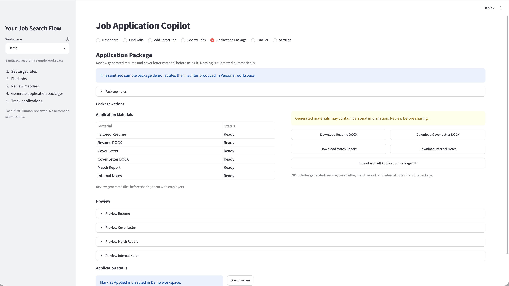

# Job Application Copilot

**Privacy-first local workflow tool for job discovery and application preparation**

[](/https://github.com/Xieyizhou/job-application-copilot/actions/workflows/ci.yml)

Job Application Copilot is a Streamlit application for collecting job listings,
reviewing candidate-role fit, preparing tailored documents, and tracking manual
applications. It uses deterministic keyword matching and rule-based templates;
it does not submit applications or automate job platforms.

## Quick Demo


This walkthrough uses only the sanitized Demo workspace: Dashboard → Review
Jobs → open a fictional job → Fit Analysis → Application Package.

## Highlights

- Integrates Adzuna and Jooble job-search APIs with local deduplication and
  normalized Markdown storage.
- Accepts manual job input from pasted text, documents, PDFs, and screenshots,
  with confidence-aware field suggestions for review.
- Produces an explainable fit summary with matched evidence, missing keywords,
  risk notes, and a recommendation.
- Generates a tailored resume, cover letter, match report, internal notes,
  DOCX files, and a whitelisted ZIP package.
- Separates a sanitized read-only Demo workspace from ignored Personal data,
  generated files, API keys, and the local SQLite tracker.
- Includes focused unit, integration, document-extraction, and Streamlit runtime
  tests.

## Product Walkthrough

### Dashboard


### Review Jobs


### Fit Analysis


### Application Package



## Workflow

1. Fetch jobs through an API or add a target role manually.
2. Review normalized company, role, location, and job-description fields.
3. Compare the role with the active candidate profile.
4. Generate and review an application package.
5. Export files and update the local tracker manually.

## Quick Start

```bash
git clone https://github.com/your-account/job-application-copilot.git
cd job-application-copilot
python3 -m venv .venv
source .venv/bin/activate
python -m pip install --upgrade pip
python -m pip install -r requirements.txt
python run_dashboard.py
```

The app opens in Demo workspace and does not require API keys. It has been
tested with Python 3.11.9 on macOS ARM and Python 3.12.13 on Linux.

If local rendering is unstable, use `python run_dashboard.py` rather than
invoking Streamlit directly. The launcher selects PyArrow's system memory pool
before Streamlit starts for stable local rendering.

## Demo and Personal Workspaces

- **Demo** loads fictional jobs and a sanitized read-only package from
  `data/demo/`. It makes no live API requests and does not write tracker or
  generated-package data.
- **Personal** requires a local Markdown, TXT, DOCX, or text-based PDF candidate
  source. Optional inputs include an experience-bank YAML file and a cover-letter
  DOCX template.
- Personal files are normalized and stored under `data/local_workspace/`, which
  is ignored by Git.
- Generated documents should always be reviewed before use.

To enable live job fetching, copy `.env.example` to `.env` and add one or both
provider credentials:

```text
ADZUNA_APP_ID=your_adzuna_app_id
ADZUNA_APP_KEY=your_adzuna_app_key
JOOBLE_API_KEY=your_jooble_api_key
```

## Technical Stack

Python, Streamlit, SQLite, python-docx, PyMuPDF, pdfplumber, pytesseract,
Adzuna API, Jooble API, local file storage, and ZIP export.

## Privacy and Safety

- Candidate files and generated materials stay on the local machine.
- API keys stay in the ignored `.env` file.
- Demo content is fictional, sanitized, and isolated from Personal data.
- The app does not scrape or automate LinkedIn, Indeed, or other job platforms.
- Nothing is submitted automatically.

Run the release privacy check with:

```bash
python scripts/privacy_audit.py
```

An optional ignored `privacy_terms.local.txt` file can add private terms to the
scan; see `privacy_terms.local.example.txt` for the format.

## Validation

```bash
python -m py_compile main.py scripts/privacy_audit.py src/*.py
python -m unittest discover -s tests -v
python scripts/privacy_audit.py
```

The clean-release baseline passes 17 tests, dependency consistency checks,
privacy scanning, and a Streamlit health check.

## Limitations

- Live search depends on provider credentials, availability, and rate limits.
- Provider descriptions may be partial and should be checked on the source page.
- OCR requires a local Tesseract installation.
- Fit scores and generated text are heuristic decision support, not predictions.
- DOCX formatting is intentionally simple and requires manual review.
- The project is a local single-user application, not a hosted service.

Detailed commands and workspace behavior are documented in
[`docs/USAGE.md`](docs/USAGE.md).
