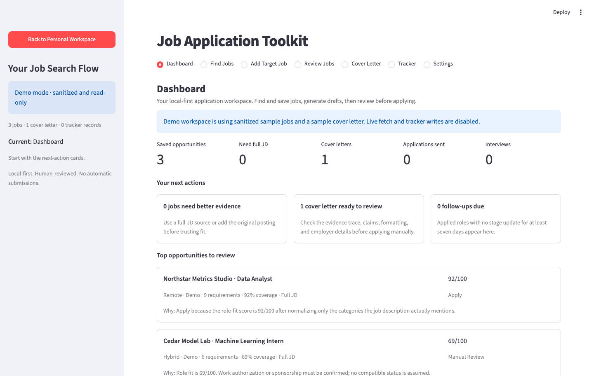
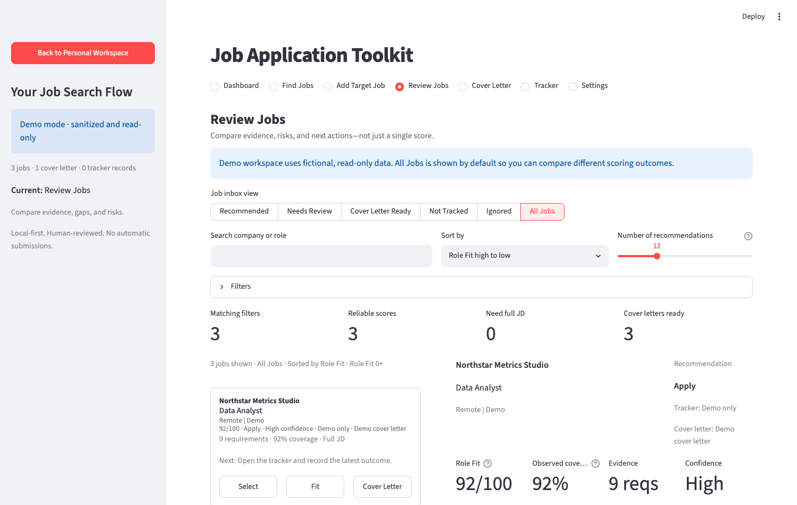
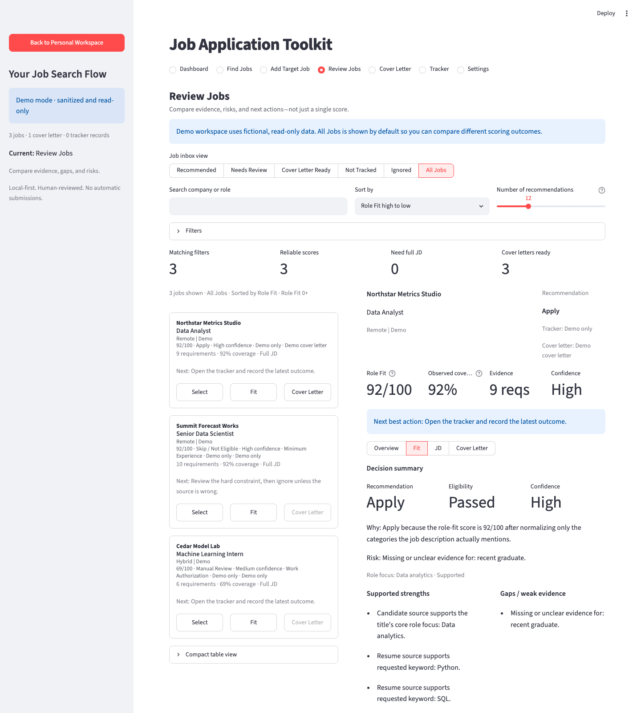
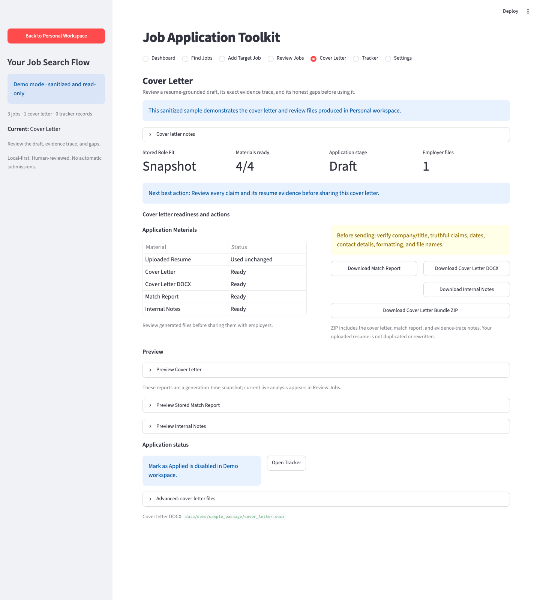
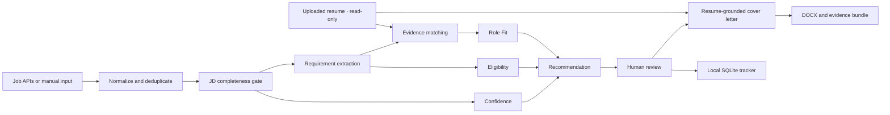

# Job Application Toolkit

**Privacy-first, local-first workflow for job discovery and application preparation**

[](https://github.com/Xieyizhou/job-application-copilot/actions/workflows/ci.yml)
[](LICENSE)

Job Application Toolkit is a local-first Streamlit application for collecting job listings,
reviewing candidate-role fit, preparing resume-grounded cover letters, and
tracking manual applications.

The toolkit uses deterministic requirement matching, eligibility checks,
confidence-aware scoring, and rule-based document generation. It does not submit
applications, scrape restricted job platforms, or make hiring predictions.

## Quick Demo


The walkthrough uses only fictional and sanitized data:

**Dashboard → Review Jobs → Fit Analysis → Cover Letter**

## Highlights

- Uses JSearch for complete job descriptions and Adzuna/Jooble as optional discovery sources.
- Deduplicates fetched jobs and stores normalized descriptions as local Markdown.
- Accepts manually added jobs from pasted text, documents, PDFs, and screenshots.
- Normalizes company, role, location, source, and job-description fields before use.
- Produces an explainable Role Fit assessment using:
  - required and preferred terms
  - direct and partial evidence
  - missing candidate evidence
  - experience and education requirements
  - eligibility checks
  - scoring confidence
  - a final recommendation
- Detects incomplete job descriptions, calibrates narrow matches toward a neutral prior,
  and labels the result provisional instead of presenting misleading confidence.
- Uses one current scoring result across Dashboard summaries, Review Jobs,
  Fit Analysis, Tracker preparation, and newly generated cover-letter bundles.
- Generates:
  - resume-grounded cover-letter drafts
  - fit-analysis reports
  - evidence-trace and gap-audit notes
  - cover-letter DOCX files
  - a restricted ZIP export
- Keeps the uploaded resume unchanged; it is used as the factual source and is
  never rewritten by the generation workflow.
- Separates fictional Demo data from ignored Personal files, API keys,
  generated outputs, and the local SQLite tracker.
- Includes regression, integration, extraction, document-export, privacy,
  and Streamlit runtime tests.

## Product Walkthrough

### Dashboard



### Review Jobs



### Fit Analysis



### Cover Letter



## Architecture



The uploaded resume remains unchanged. Fit, eligibility, and confidence are separate
decision signals; no application is submitted automatically.

## Workflow

1. Fetch jobs through a supported API or add a target role manually.
2. Review normalized company, role, location, and job-description fields.
3. Compare the job requirements with the active candidate profile.
4. Review Role Fit, eligibility, scoring confidence, and missing evidence.
5. Generate a resume-grounded cover letter.
6. Review and export the generated files.
7. Update the local application tracker manually.

## Quick Start

```bash
git clone https://github.com/Xieyizhou/job-application-copilot.git
cd job-application-copilot

python3 -m venv .venv
source .venv/bin/activate

python -m pip install --upgrade pip
python -m pip install -r requirements.txt

python run_dashboard.py
```

The application opens in the Personal workspace. Use **Explore Read-only Demo** in the
sidebar to inspect the sanitized workflow without API credentials or Personal data.

The toolkit has been tested with:

- Python 3.11 on macOS ARM
- Python 3.12 on Linux

Use `python run_dashboard.py` rather than calling Streamlit directly. The
launcher configures the local rendering environment before starting the app.

## Demo and Personal Workspaces

### Demo

Demo is a separate sidebar action rather than a Personal workspace option.
The Demo workspace:

- loads fictional jobs from `data/demo/`
- includes a sanitized sample cover-letter bundle
- makes no live API requests
- does not write tracker records
- does not generate Personal application files

Some bundled files are historical generation-time snapshots and are not
automatically recalculated when the scoring implementation changes.

### Personal

The Personal workspace accepts a candidate source in one of these formats:

- Markdown
- TXT
- DOCX
- text-based PDF

Optional Personal inputs include:

- an experience-bank YAML file
- a cover-letter DOCX template

Personal workspace files are stored under:

```text
data/local_workspace/
```

This directory is ignored by Git.

Generated cover letters and analysis reports should always be reviewed before use.

## Live Job Search

To enable live search, copy the example environment file:

```bash
cp .env.example .env
```

Add credentials for any providers you plan to use:

```text
ADZUNA_APP_ID=your_adzuna_app_id
ADZUNA_APP_KEY=your_adzuna_app_key
JOOBLE_API_KEY=your_jooble_api_key
JSEARCH_API_KEY=your_openwebninja_jsearch_api_key
```

The `.env` file is ignored by Git and must never be committed.

Search behavior includes:

- configurable role queries
- preset or custom locations
- configurable source limits
- duplicate detection
- previously seen job tracking
- local Markdown storage
- source-specific error handling
- full job descriptions through JSearch when `JSEARCH_API_KEY` is configured

JSearch is preferred for scoring because it returns detailed job descriptions. Adzuna and
Jooble remain useful discovery sources, but their official search APIs return description
snippets; those records stay provisional until a full JD is available.

## Role Fit Assessment

The toolkit uses a deterministic and explainable scoring pipeline rather than a
trained prediction model.

The assessment considers:

- core technical requirements
- domain overlap
- candidate experience evidence
- project relevance
- communication-related requirements
- required versus preferred terms
- direct versus partial matches

Role Fit is kept separate from:

- eligibility
- work-authorization review
- scoring confidence
- final recommendation

A high raw match percentage does not automatically produce an Apply
recommendation.

See [Scoring Method](docs/SCORING_METHOD.md) for the scoring, gating, and public
benchmark methodology.

For example, when only one requirement is recognized, the app may show:

```text
Role Fit: Provisional 62/100
Observed Requirement Coverage: 100%
Eligibility: Passed
Scoring Confidence: Low
Recommendation: Manual Review
Recognized requirements: 1
Matched requirements: 1 of 1
```

This preserves the observed match while preventing a narrow `1 of 1` result from
being presented as a reliable perfect fit.

## Cover Letter Bundle

A generated bundle may include:

- `cover_letter.md`
- `cover_letter.docx`
- `analysis.md`
- `cover_letter_notes.md` with exact resume evidence and honest gaps
- a restricted ZIP export

The cover-letter bundle generator:

- uses the uploaded resume as the only source for employer-facing candidate claims
- preserves the canonical company and role
- includes eligibility and scoring-confidence information
- records the generation-time analysis
- never rewrites or regenerates the uploaded resume
- adds the application to the local tracker when requested

Existing bundles remain historical snapshots and are not automatically
rewritten.

## Local Tracker

The SQLite tracker stores application records such as:

- company
- role
- location
- source URL
- Role Fit score
- recommendation
- application status
- generated file paths
- notes
- application date

The application does not submit forms or change employer-side application
systems.

## Technical Stack

- Python
- Streamlit
- SQLite
- python-docx
- PyMuPDF
- pdfplumber
- pytesseract
- Pillow
- JSearch API for complete job descriptions
- Adzuna and Jooble APIs for discovery snippets
- local Markdown storage
- ZIP export

## Privacy and Safety

- Candidate files stay on the local machine.
- Generated application materials stay on the local machine.
- API credentials stay in the ignored `.env` file.
- Personal workspace data is excluded from Git.
- Demo content is fictional and sanitized.
- The application does not scrape LinkedIn, Indeed, or other restricted
  platforms.
- The application does not submit job applications automatically.
- Generated documents require manual review before use.
- Fit results are decision-support signals, not hiring predictions.

Run the release privacy check with:

```bash
python scripts/privacy_audit.py
```

An optional ignored file can add private terms to the scan:

```text
privacy_terms.local.txt
```

See `privacy_terms.local.example.txt` for the expected format.

## Validation

Run the complete automated test suite:

```bash
python -m py_compile main.py scripts/privacy_audit.py scripts/evaluate_scoring.py src/*.py
python -m unittest discover -s tests -v
python scripts/evaluate_scoring.py
python -m pip check
python scripts/privacy_audit.py
```

The release checks cover:

- deterministic scoring regression across 48 curated fictional cases
- dashboard scoring integration
- title normalization
- tracker behavior
- cover-letter bundle parsing
- document extraction
- export behavior
- privacy scanning
- dependency consistency
- Streamlit runtime behavior

A `48/48` benchmark result means that the current rules agree with all 48 expected outcomes in this curated regression set. It is not model accuracy, a hiring-success rate, or validation on real applicants.

## Project Structure

```text
job-application-copilot/
├── data/
│   └── demo/
├── docs/
│   ├── assets/
│   └── USAGE.md
├── scripts/
│   └── privacy_audit.py
├── src/
│   ├── analyze_job.py
│   ├── apply_package.py
│   ├── dashboard.py
│   ├── dashboard_cover_letter.py
│   ├── dashboard_fetch.py
│   ├── dashboard_fit.py
│   ├── dashboard_home.py
│   ├── dashboard_manual.py
│   ├── dashboard_packages.py
│   ├── dashboard_regions.py
│   ├── dashboard_review.py
│   ├── dashboard_review_page.py
│   ├── dashboard_settings.py
│   ├── dashboard_shell.py
│   ├── dashboard_titles.py
│   ├── dashboard_tracker.py
│   ├── fetch_jobs.py
│   ├── manual_jobs.py
│   ├── tracker.py
│   └── workspace.py
├── tests/
├── .env.example
├── main.py
├── requirements.txt
├── run_dashboard.py
└── README.md
```

Local Personal data and generated outputs are excluded from the public
repository.

`dashboard.py` remains the Streamlit entry point and compatibility surface. The
focused `dashboard_*` modules isolate the home, job discovery, review,
manual-job, cover-letter, tracker, and settings pages from shared title
normalization, fit presentation, region filters, review rules, safe bundle
exports, and application-shell behavior. Page modules receive their shared
operations explicitly, which keeps the local toolkit easier to test and change
without hidden global coupling.

## Limitations

- Live search depends on provider credentials, availability, and rate limits.
- JSearch normally supplies complete descriptions; Adzuna and Jooble search results may be incomplete snippets.
- Source listings should be verified on the original employer or provider page.
- Requirement extraction is deterministic and may not recognize every unusual
  phrase, synonym, or job-description format.
- Scoring depends on the quality and completeness of both the job description
  and candidate source.
- Existing Tracker rows and generated bundles are historical snapshots.
- OCR quality depends on image clarity and local Tesseract installation.
- Scanned PDFs may require OCR before useful text can be extracted.
- Generated DOCX formatting is intentionally simple.
- Generated application materials require manual review.
- The toolkit is a local single-user application, not a hosted service.

## Documentation

Detailed setup instructions, workspace behavior, and command examples are
available in:

[`docs/USAGE.md`](docs/USAGE.md)

## License

This project is licensed under the [MIT License](LICENSE).
