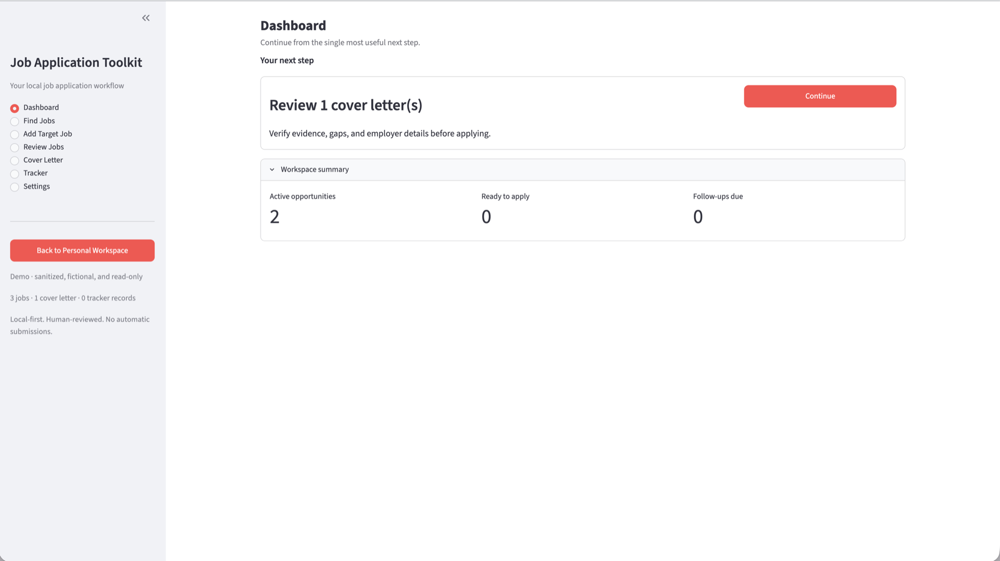
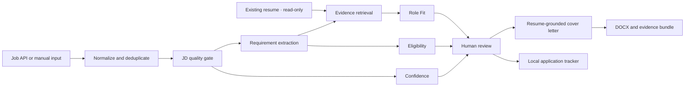

# Job Application Toolkit

**A privacy-first, local Streamlit application for evaluating job fit and preparing
evidence-grounded applications.**

[](LICENSE)

Turns an existing resume and a job description into an explainable fit review,
evidence trace, cover letter, and local application record.

## Demo


The read-only Demo uses fictional, sanitized data and requires no API credentials.

### Dashboard



### Review Jobs


### Cover Letter


## Highlights

- Explainable Role Fit with independent Eligibility, Confidence, and JD Quality.
- Local semantic retrieval from JD requirements to exact resume evidence.
- Quality gates that block unreliable scoring and employer-facing output.
- Resume-grounded cover letters with evidence traces and explicit gaps.
- Failure-driven MiniLM distillation with grouped splits, leakage audits, frozen
  evaluations, and an integrity-checked Web-shadow runtime.
- Local Streamlit workflow backed by Markdown and SQLite.

## Product workflow


```mermaid
flowchart LR
    A["Job API or manual input"] --> B["Normalize and deduplicate"]
    B --> C["JD quality gate"]
    C --> D["Requirement extraction"]
    R["Existing resume · read-only"] --> E["Evidence retrieval"]
    D --> E
    E --> F["Role Fit"]
    D --> G["Eligibility"]
    C --> H["Confidence"]
    F --> I["Human review"]
    G --> I
    H --> I
    I --> J["Resume-grounded cover letter"]
    J --> K["DOCX and evidence bundle"]
    I --> L["Local application tracker"]
```

The resume remains read-only; the application generates only a cover letter and
supporting analysis.

## Machine Learning

### Task and trust design

The primary ML task is deliberately narrow:

```text
JD requirement + resume statements
    → strongest evidence
    → Direct / Partial / No Support
```

Each result retains its requirement, evidence sentence, source section, and support
level. Low-support evidence cannot enter the cover letter.

Role Fit remains separate from Eligibility, Confidence, JD Quality, and the ML
evidence signal. Incomplete JDs remain provisional. Learned candidates are evaluated
offline with source-grouped development data and frozen reserves. The v21 candidate is
available through an opt-in, background Web Shadow path; learned output does not change
product decisions.

See the [Model Card](docs/MODEL_CARD.md) for evaluation results and promotion gates.

### Engineering case study

The learned evidence system was developed as a production-style ML lifecycle rather than
a one-off fine-tuning experiment. It records failed candidates, isolates resume groups,
audits exact and near-text leakage, retires consumed evaluations, freezes candidates before
new final tests, and verifies offline/runtime parity before shadow integration.

The current v21 candidate uses a shared MiniLM encoder with support, Direct/Partial
strength, and strongest-evidence ranking heads. On frozen E15 (96 tasks / 384 pairs), it
reached **90.63% task agreement**, **89.62% macro-F1**, **90.00% No-Support recall**, and
**100% supported Top-1**. Its self-contained 91.6 MB bundle measured **137.9 pairs/s**,
**41.5 ms p95 task latency**, and **876.6 MB peak RSS** on Apple MPS.

These are synthetic-teacher agreement measurements, not human-gold accuracy or hiring
outcome predictions. See [From Retrieval Prototype to Web-Ready ML Candidate](docs/ML_SYSTEM_CASE_STUDY.md)
for the architecture, failure analysis, data contracts, deployment gates, and resume-ready
engineering summary.

## Quick start

Requires Python 3.11 or 3.12.

```bash
python3 -m venv .venv
source .venv/bin/activate
python -m pip install --upgrade pip
python -m pip install -r requirements.txt
python run_dashboard.py
```

Choose **Explore Read-only Demo** in the sidebar. Personal mode accepts Markdown,
TXT, DOCX, and text-based PDF resumes.

## Optional live job search

Copy `.env.example` to `.env` and configure only the desired providers. JSearch is
preferred for complete JDs; Adzuna and Jooble results remain provisional when they
contain only discovery snippets.

## Technical stack

Python, Streamlit, scikit-learn, sentence-transformers, SQLite, python-docx,
PyMuPDF, Pillow, JSearch, Adzuna, Jooble, pytest, Ruff, and mypy.

## Validation

The portfolio release validation suite passes **565 tests and 160 subtests**, plus Ruff, mypy,
compileall, dependency, artifact-integrity, and privacy checks. Curated or teacher-proxy
agreement is not reported as real-world model accuracy.

Main checks:

```bash
python -m pip install -r requirements-dev.txt -r requirements-ml.txt
python -m ruff check main.py run_dashboard.py scripts src tests
PYTHONPATH=src python -m mypy
PYTHONPATH=src python scripts/run_test_group.py core
PYTHONPATH=src python -m pytest tests/test_ml_*.py -q
PYTHONPATH=src python scripts/ml/validate_minilm_v21_release.py
python scripts/privacy_audit.py
python -m pip check
```

## Privacy and product boundaries

- Personal data, credentials, annotations, models, reports, and generated documents
  remain local and excluded from Git.
- Mobile is a responsive companion for the same locally run Streamlit app—not a
  hosted service, separate mobile client, cloud-sync layer, or remote inference path.
- The application does not scrape restricted platforms, submit applications, alter
  employer systems, or predict hiring outcomes.
- Employer-facing documents require human review.

## Repository map

```text
src/                 Streamlit product and reusable domain services
src/ml/              Evidence retrieval, MiniLM objectives, lifecycle contracts, Shadow adapter
scripts/ml/          Curated public ML entry points (see its README)
tests/                Product, privacy, data-contract, and ML regression tests
docs/                 Usage, scoring, model card, and engineering case study
data/demo/            Fictional read-only demo assets
data/ml/              Local-only data and model artifacts; excluded from Git
```

The portfolio release intentionally omits private data and one-off v1–v20 experiment
launchers. Their failures and design consequences remain documented in the ML case study.
The exact v21 release contract, reusable objective components, lifecycle controls, Web
adapter, and tests remain public; a clean clone validates the contract but cannot retrain
the private teacher dataset or download unpublished weights.

## Documentation

- [Usage](docs/USAGE.md)
- [Scoring Method](docs/SCORING_METHOD.md)
- [Model Card](docs/MODEL_CARD.md)
- [ML System Case Study](docs/ML_SYSTEM_CASE_STUDY.md)
- [ML Relevance](docs/ML_RELEVANCE.md)
- [Annotation](docs/ML_ANNOTATION.md)

## License

Licensed under the [MIT License](LICENSE).
