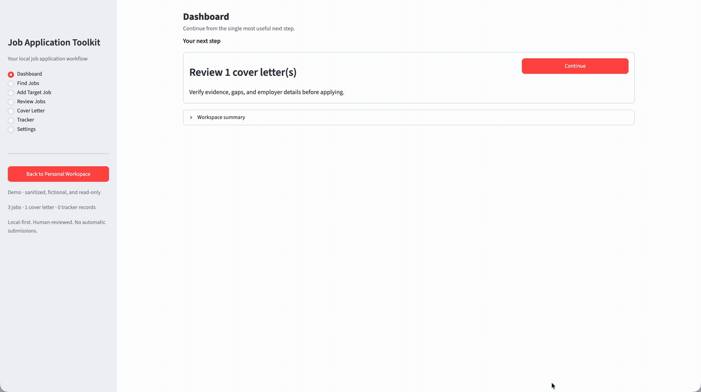
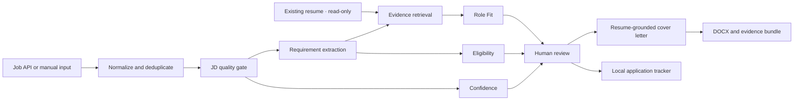

# Job Copilot

**A privacy-first local ML system that turns unstructured job descriptions into
source-backed requirements, matches them to resume evidence, and prepares reviewable
application materials.**

[](LICENSE)

It is designed around one narrow, auditable ML task:

```text
full JD → structured requirements → strongest resume evidence
        → Direct / Partial / No Support → calibrated Role Fit
```

## Demo



The read-only Demo uses fictional, sanitized data and requires no API credentials.

## Why ML matters here

Keyword search alone misses paraphrases and cannot identify the strongest factual resume
statement. Job Copilot separates four concerns:

- **JD acquisition and quality:** incomplete snippets cannot produce a trusted score.
- **Requirement extraction:** employer text is normalized into source-backed required,
  preferred, responsibility, and constraint records.
- **Evidence retrieval:** each requirement is mapped to the strongest resume statement.
- **Decision safety:** Role Fit remains separate from Eligibility, Confidence, and JD Quality.

The learned MiniLM candidate uses support, Direct/Partial strength, and ranking heads. On
frozen synthetic-teacher E15 (96 tasks / 384 pairs), v21 reached **90.63% task agreement**,
**89.62% macro-F1**, **90% No-Support recall**, and **100% supported Top-1**. These are
teacher-agreement measurements—not human-gold accuracy or hiring-outcome predictions.

See the [Model Card](docs/MODEL_CARD.md) and
[ML System Case Study](docs/ML_SYSTEM_CASE_STUDY.md) for promotion gates, failure analysis,
data isolation, latency, and limitations.

## Product workflow


```mermaid
flowchart LR
    A["Job API or manual input"] --> B["Normalize and deduplicate"]
    B --> C["JD quality gate"]
    C --> D["Requirement extraction"]
    R["Existing resume · read-only"] --> E["Evidence retrieval"]
    D --> E
    E --> F["Role Fit"]
    D --> G["Eligibility"]
    C --> H["Confidence"]
    F --> I["Human review"]
    G --> I
    H --> I
    I --> J["Resume-grounded cover letter"]
    J --> K["DOCX and evidence bundle"]
    I --> L["Local application tracker"]
```

The resume remains read-only; the application generates only a cover letter and
supporting analysis.

## Quick start

The stable desktop release supports Python 3.11 or 3.12 on macOS. Chrome is the
supported browser for the optional local import companion. Edge compatibility remains
experimental and unverified; Safari extension import is outside this release's scope. Linux remains covered by
automated tests, but this release does not claim Windows support.

```bash
git clone https://github.com/Xieyizhou/job-application-copilot.git
cd job-application-copilot
python3.12 -m venv .venv  # python3.11 is also supported
source .venv/bin/activate
python -m pip install --upgrade pip
python -m pip install -r requirements.txt
python run_dashboard.py
```

Choose **Explore Read-only Demo** in the sidebar. Personal mode accepts Markdown, TXT,
DOCX, and text-based PDF resumes.

Local release acceptance used macOS 26.6.2 on Apple Silicon, Python 3.11.9 and
3.12.13, and Chrome v152.0.7977.76 for native extension import. See the
[acceptance report](docs/RELEASE_ACCEPTANCE.md) for evidence and unverified scope.

## Optional live job search

JSearch, Adzuna, and Jooble are experimental in v1.0.0. Each passed a minimal live
search; broader provider behavior, quotas, and availability remain outside stable acceptance.

Copy `.env.example` to `.env` and configure only the desired providers. The recovery path
prefers public Greenhouse/Lever ATS endpoints, then structured JobPosting JSON-LD, safe
page extraction, JSearch, or a locally saved browser page. Adzuna and Jooble snippets remain
provisional until a complete JD is verified.

### Import the job page already open in your browser

For employer sites that block server-side fetching, Job Copilot includes a local Chrome
companion in `browser_companion/`. Start the app with `python run_dashboard.py`, then open
**Settings → Job sources** for the one-time **Load unpacked** path and local connection token.
When a previously saved job page is open, click **Import and verify this posting**. The extension
reads JobPosting JSON-LD or the visible job container and sends it only to `127.0.0.1`; the local
service updates the saved job only after URL/company/role and JD-quality checks pass.

## Validation

The release workflow runs the complete core and ML suites on Python 3.11 and 3.12, plus
Ruff, mypy, compileall, dependency, scoring, v21 contract, privacy, and macOS launcher
checks. Test collection is audited, but a fixed test count is not used as a release gate.
Curated or teacher-proxy agreement is not reported as real-world model accuracy.

The [code simplification review](docs/CODE_SIMPLIFICATION_REVIEW.md) records the full
feature matrix, architecture changes, compatibility notes, and rollback checkpoints.
The core runner includes both pytest functions and unittest classes.

Main checks:

```bash
python -m pip install -r requirements-dev.txt -r requirements-ml.txt
python -m ruff check main.py run_dashboard.py scripts src tests
PYTHONPATH=src python -m mypy
PYTHONPATH=src python scripts/run_test_group.py core
PYTHONPATH=src python -m pytest tests/test_ml_*.py -q
PYTHONPATH=src python scripts/ml/validate_minilm_v21_release.py
python scripts/privacy_audit.py
python -m pip check
```

The default mypy target is Python 3.11, matching the compatibility CI job. In a Python
3.12 environment with optional ML dependencies, run `python -m mypy --python-version 3.12`
so third-party type stubs are parsed for the installed interpreter.

## Privacy and product boundaries

- Personal data, credentials, annotations, models, reports, and generated documents
  remain local and excluded from Git.
- Desktop is the v1.0.0 acceptance target. Narrow-screen acceptance is deferred;
  the app remains locally run, with no hosted service or cloud sync.
- The application does not scrape restricted platforms, submit applications, alter
  employer systems, or predict hiring outcomes.
- Employer-facing documents require human review.

## Repository map

```text
src/                 Streamlit product and reusable domain services
src/ml/              Evidence retrieval, MiniLM objectives, lifecycle contracts, Shadow adapter
scripts/ml/          Curated public ML entry points (see its README)
tests/                Product, privacy, data-contract, and ML regression tests
docs/                 Usage, scoring, model card, and engineering case study
data/demo/            Fictional read-only demo assets
data/ml/              Local-only data and model artifacts; excluded from Git
```

The public release intentionally omits private data and one-off v1–v20 experiment
launchers. Their failures and design consequences remain documented in the ML case study.
The exact v21 release contract, reusable objective components, lifecycle controls, Web
adapter, and tests remain public; a clean clone validates the contract but cannot retrain
the private teacher dataset or download unpublished weights.

## Documentation

[Usage](docs/USAGE.md) · [Scoring Method](docs/SCORING_METHOD.md) ·
[Model Card](docs/MODEL_CARD.md) · [ML System Case Study](docs/ML_SYSTEM_CASE_STUDY.md) ·
[Release acceptance](docs/RELEASE_ACCEPTANCE.md) · [Security](SECURITY.md) ·
[Third-party notices](THIRD_PARTY_NOTICES.md)

## License

Licensed under the [MIT License](LICENSE).
