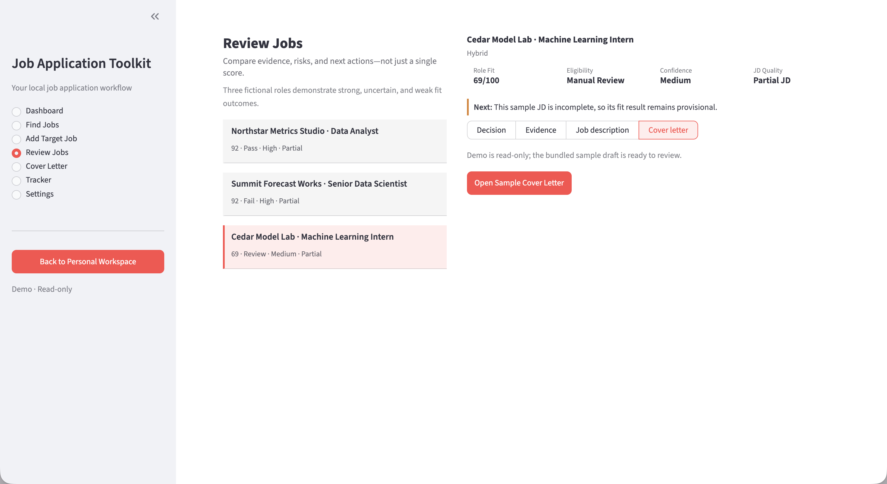
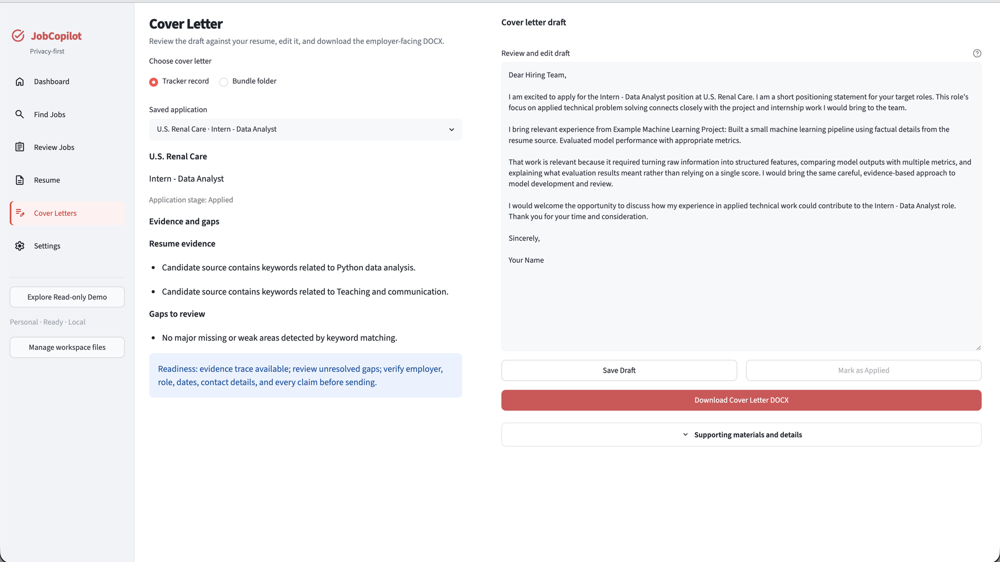
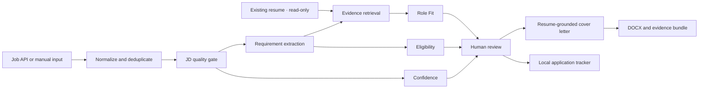

# Job Application Toolkit

**A privacy-first, local Streamlit application for evaluating job fit and preparing
evidence-grounded applications.**

[](LICENSE)

Turns an existing resume and a job description into an explainable fit review,
evidence trace, cover letter, and local application record.

## Demo


The read-only Demo uses fictional, sanitized data and requires no API credentials.

### Review Jobs



### Cover Letter



## Highlights

- Explainable Role Fit with independent Eligibility, Confidence, and JD Quality.
- Local semantic retrieval from JD requirements to exact resume evidence.
- Quality gates that block unreliable scoring and employer-facing output.
- Resume-grounded cover letters with evidence traces and explicit gaps.
- Human-reviewed ML evaluation with grouped splits and frozen holdouts.
- Local Streamlit workflow backed by Markdown and SQLite.

## Product workflow


```mermaid
flowchart LR
    A["Job API or manual input"] --> B["Normalize and deduplicate"]
    B --> C["JD quality gate"]
    C --> D["Requirement extraction"]
    R["Existing resume · read-only"] --> E["Evidence retrieval"]
    D --> E
    E --> F["Role Fit"]
    D --> G["Eligibility"]
    C --> H["Confidence"]
    F --> I["Human review"]
    G --> I
    H --> I
    I --> J["Resume-grounded cover letter"]
    J --> K["DOCX and evidence bundle"]
    I --> L["Local application tracker"]
```

The resume remains read-only; the application generates only a cover letter and
supporting analysis.

## ML and trust design

The primary ML task is deliberately narrow:

```text
JD requirement + resume statements
    → strongest evidence
    → Direct / Partial / No Support
```

Each result retains its requirement, evidence sentence, source section, and support
level. Low-support evidence cannot enter the cover letter.

Role Fit remains separate from Eligibility, Confidence, JD Quality, and the ML
evidence signal. Incomplete JDs remain provisional. Learned candidates are evaluated
offline with source-grouped development data and frozen reserves; none currently
changes product decisions.

See the [Model Card](docs/MODEL_CARD.md) for evaluation results and promotion gates.

## Quick start

Requires Python 3.11 or 3.12.

```bash
python3 -m venv .venv
source .venv/bin/activate
python -m pip install --upgrade pip
python -m pip install -r requirements.txt
python run_dashboard.py
```

Choose **Explore Read-only Demo** in the sidebar. Personal mode accepts Markdown,
TXT, DOCX, and text-based PDF resumes.

## Optional live job search

Copy `.env.example` to `.env` and configure only the desired providers. JSearch is
preferred for complete JDs; Adzuna and Jooble results remain provisional when they
contain only discovery snippets.

## Technical stack

Python, Streamlit, scikit-learn, sentence-transformers, SQLite, python-docx,
PyMuPDF, Pillow, JSearch, Adzuna, Jooble, pytest, Ruff, and mypy.

## Validation

The repository includes 176 core tests, 204 ML/data-contract tests, 48 curated
scoring regression cases, 24 de-identified semantic-evidence cases, privacy checks,
and separate coverage gates. Curated agreement is not reported as model accuracy.

Main checks:

```bash
python -m pip install -r requirements-dev.txt -r requirements-ml.txt
python -m ruff check main.py run_dashboard.py scripts src tests
PYTHONPATH=src python -m mypy
PYTHONPATH=src python scripts/run_test_group.py core
PYTHONPATH=src python -m pytest tests/test_ml_*.py -q
python scripts/privacy_audit.py
python -m pip check
```

## Privacy and product boundaries

- Personal data, credentials, annotations, models, reports, and generated documents
  remain local and excluded from Git.
- The application does not scrape restricted platforms, submit applications, alter
  employer systems, or predict hiring outcomes.
- Employer-facing documents require human review.

## Documentation

- [Usage](docs/USAGE.md)
- [Scoring Method](docs/SCORING_METHOD.md)
- [Model Card](docs/MODEL_CARD.md)
- [ML Relevance](docs/ML_RELEVANCE.md)
- [Annotation](docs/ML_ANNOTATION.md)

## License

Licensed under the [MIT License](LICENSE).
