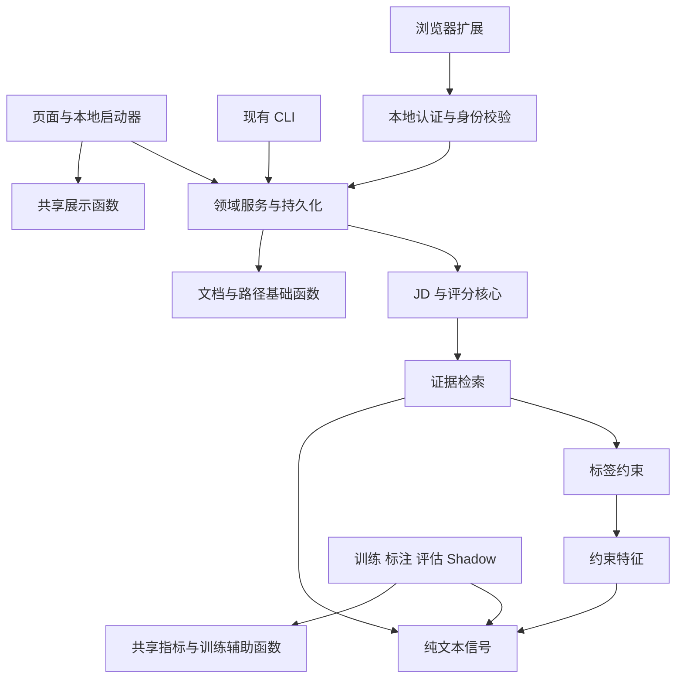

# Code graph 审视与代码精简验收

日期：2026-09-07。分支：`refactor/code-graph-simplification`。

## 结果与基线

基线为提交 `62f181a`：包含原工作区全部未提交产品功能、浏览器扩展和虚构 Demo 资产。原分支的 HEAD 为 `ebe1e34`。代码验收版本为 `b981607`；后续提交仅补充本报告和 README。

全部产品与研发能力保留；UI 流程、启动命令、持久化格式、评分语义及模型产物契约未更改。独立修复了两项验证问题：核心测试入口漏跑普通 pytest 函数，以及虚构 Demo 邮箱触发隐私误报。

| 指标 | 基线 | 完成后 |
|---|---:|---:|
| `src` Python 物理行数 | 40,447 | 39,816 |
| 顶层函数 | 1,159 | 1,111 |
| 函数体完全相同的候选组 | 14 | 0 |
| 页面服务字段 | 86 | 62 |
| 独立页面服务工厂 | 7 | 0 |
| 源码导入环，包含函数内导入 | 1 | 0 |
| `dashboard.py` 行数 | 1,163 | 800 |
| `analyze_job.py` 行数 | 231 | 66 |
| Python 源文件数 | 150 | 156 |
| 内部模块直接导入边 | 382 | 423 |

净减少 631 行、48 个顶层函数。文件数和直接导入边增加，是因为移除了中央转发接口、分离了文件提取与存储，并给真正共享的底层逻辑明确归属。没有通过压缩排版、减少功能或降低覆盖率门槛追求更小数字。

“完全相同”统计比较去除函数文档字符串后的 AST 函数体，不代表所有语义重复都能由静态分析证明。进一步合并仍需证明语义一致。

## 审视结论与架构



| 发现 | 处理与证据 | 保留边界 |
|---|---|---|
| 分析入口承担大量历史重导出 | `analyze_job` 保留原 CLI，生产和测试直接导入所属评分模块 | 所有启动命令与评分结果保持兼容 |
| 页面工厂、包装函数与无效注入重复 | 七个页面直接构造所需服务；稳定展示函数直接引用；删除不用的字段 | 工作区、缓存、读写、网络和状态操作继续保留必要注入 |
| 文本、URL、指标与训练辅助实现重复 | 合并 Markdown 元数据、文档标点、证据清洗、均值、对齐校验、训练种子/编码、URL 清理、时间与路径函数 | 不同 URL 身份规则、NFKC 哈希、领域专用归一化保持独立 |
| ML 三模块相互依赖 | 将词法常量和纯函数移至 `ml.evidence_text`；标签约束无需反向导入检索流程 | 保留标签阈值、模型目标与输出语义 |
| 手动导入混合存储、文件提取、推断 | 存储留在 `manual_jobs`；可选 PDF/OCR 提取进入 `job_document`；纯解析进入 `manual_jd_parser` | 26 组解析结果一致，提取回退行为和所有输入能力保留 |
| 已退役展示与旧评分辅助代码仍驻留 | 删除无调用的卡片渲染链、旧轻量评分、旧段落拼接与多余 shell 包装 | 当前完整分析、求职信和页面入口仍由运行测试验证 |
| 测试限定拆文件方式与旧导入存在 | 改为依赖方向、页面装配、CLI 行为、HTML 转义和全源码无导入环检查 | 业务断言及数据安全用例保留；没有降低覆盖率门槛 |

Code Review Graph 在第一次重建时漏掉部分未跟踪源码；保存基线提交后重建才覆盖完整代码。有效基线图为 **277 文件、2,642 节点、29,823 边**；完成后的图为 **283 文件、2,595 节点、29,636 边**。局部影响分析触及 96 个额外文件，并触发 500 节点返回上限，因此验收使用完整测试，而不是只运行图工具推荐的测试。

完成后图工具仍报告 75 个“死代码”候选，另有结构热点及跨社区耦合警告。它们不是自动删除清单：回调、别名导入、TypedDict、模型 `forward`/`predict`、独立训练和 Shadow 接口存在静态图盲区。逐项处置保存在本地审视产物中。尤其保留：

- 独立训练、标注、采样、评估和 Shadow API；没有产品直接调用不等于没有研发用途。
- 本地服务停止方法、排序回调和页面渲染入口；由生命周期或 UI 间接调用。
- 不生成文档就保存 Tracker 记录的现有辅助能力，以及它的规范字段契约。
- 启动器的 PyArrow system allocator 初始化；临时 QA 绕过该初始化时原版和新版均发生 native 退出，按正式启动器初始化后连续流程通过。此处没有产品代码变更。
- 仍较大的纯 JD 解析模块，其规则协同构成已有解析行为；不为降低单文件行数重新制造转发层。

## 功能验收矩阵

下列数据副作用均在临时工作区或受控测试中验证。实际个人数据不用于生成演示截图。

| 能力与入口 | 主调用链/数据副作用 | 验证 |
|---|---|---|
| Dashboard、Resume、工作区切换 | 页面 → Workspace；候选文件、manifest、session state | workspace、candidate_document、demo_resume_readonly、AppTest；Demo 输入禁用、原简历不改写 |
| 搜索与历史 | Find Jobs/`main.py fetch` → provider → 去重 → Markdown/历史索引 | dashboard_fetch_runtime、dashboard_fetch_history、full_jd_source；空结果、失败和重复记录 |
| 手动岗位导入与维护 | 页面 → 文件提取/解析 → 手动记录存储 | manual_jobs_lifecycle、dashboard_manual_helpers；26 组前后解析对比，PDF/OCR 回退、损坏输入 |
| ATS、网页及粘贴补全 | 补全入口 → 公司/角色/URL 校验 → JD 质量门槛 → 保存 | company_ats、ats_jd_completion、job_page_fetch、jd_enrichment、review_jobs_repairs |
| 浏览器补全 | 扩展 → 本地带 token 的 HTTP → 身份与 JD 校验 | browser_companion 实际 HTTP 测试；JS 提取与 popup 8 类受控场景 |
| JD 结构化与证据 | UI/CLI → 结构化需求 → 证据检索/标签约束 | structured_jd、evidence_label_guards、ML evidence 系列；空/不完整 JD、否定和学历/年限约束 |
| 评分、筛选、排序、缓存 | 规范分析 → 展示/筛选；缓存随输入和工作区变化 | scoring_regression、scoring_benchmark、dashboard_scoring、analysis_service、review runtime |
| 求职信、编辑与导出 | 已确认资料 → 证据计划 → Markdown/DOCX/ZIP | cover_letter_generation、workspace_integration、demo_package；证据门槛、文件结构、旧包兼容 |
| Tracker 与归档 | 现有 CLI/UI → SQLite 状态/日期；岗位归档同步 | tracker_lifecycle、dashboard_tracker_runtime、saved_job_deletion；重复、状态变更、原 applied 日期与工作区限制 |
| 标注、数据分区与评审 | 保留现有 ML 命令 → 本地数据/manifest | annotation、source_lifecycle、barrier、operational/successor、holdout 系列测试 |
| 模型、训练、评估与 Shadow | 原模型类型/目标 → 指标/产物/隔离诊断 | 320 个 ML 测试，语义验证，v21 合约及本地 bundle 哈希验证；完整私有数据重训未执行 |
| 启动及发布边界 | 原启动器 → Arrow 初始化 → Streamlit/本地服务 | dashboard_launcher、隐私审计、依赖检查、编译、Ruff、mypy |

### 自动检查

- 原始快照完整 pytest：**646 passed、1 skipped、160 subtests**。快照不包含本地模型产物，相关可选检查跳过。
- 完成后：**320 core + 320 ML = 640 passed，198 subtests**。数量变化来自旧结构/重导出断言改为分组边界检查，并新增两项验证缺陷回归；没有移除产品功能测试来取得通过。
- 核心入口原来只发现 270 个 unittest 测试，漏掉普通 pytest 函数。新增“混合测试文件必须执行失败函数”的回归先失败、修复后通过，确保 CI 不再静默漏跑。
- Ruff、mypy、compileall、pip check、评分基准、语义验证、隐私审计全部通过。
- v21 公共合约与当前本地 bundle/模型哈希通过；检查未读取训练行级文本。
- 23 组分析结果，以及求职信正文、证据计划与内部说明，与基线 JSON 完全一致；26 组手动解析结果完全一致。
- 16 个 Demo、浏览器扩展及配置资产的基线哈希未变化。

| 覆盖门槛 | 最终覆盖率 | 最低要求 |
|---|---:|---:|
| 核心源码 | 76.1% | 68% |
| ML | 81.4% | 80% |
| 手动存储＋提取＋解析 | 78.3% | 70% |
| 手动导入 UI | 52.4% | 45% |
| 搜索 UI | 86.2% | 70% |
| Tracker 存储＋页面 | 86.3% | 80% |

### 浏览器 QA

环境：本地 HTTP、1440×1000 与 390×844；Browser plugin not available，使用已有 bundled Playwright 和已安装 Chrome 的隔离 headless 会话，未新增运行依赖。

原版与新版使用同一可选本地 relevance 模型及相同无凭据来源设置，按正式启动器设置 Arrow allocator，并等待 Streamlit `notRunning` 后取证。

| 检查 | 结果 |
|---|---|
| URL、页面标题、非空内容、无框架错误 | 通过 |
| 控制台 error/warning | 两版均为 0 |
| Dashboard、岗位列表与 Strong 筛选 | 通过，显示文本一致 |
| 选择 Data Analyst → Evidence/JD/Cover letter/Decision | 通过，显示文本一致 |
| Resume、Find Jobs、Cover Letters、Settings | 通过，显示文本一致 |
| 窄屏 Review Jobs | 文本一致，无页面级横向溢出；保留原版窄按钮换行及分段控件横向滚动表现 |
| 截图 | 两版各 12 个状态，另含扩展成功反馈截图 |

扩展测试覆盖 JSON-LD 和可见容器提取、缺少 token、保存 token、认证请求、成功、身份拒绝、离线恢复和打开本地应用。浏览器 `chrome.*` API 使用 fixture，popup 的 HTTP 响应被拦截；真实本地 HTTP 的认证、身份与写入契约另由 Python 集成测试验证。没有执行用户浏览器中的原生扩展安装/授权，也没有发起真实招聘来源查询。

## Python 接口迁移

启动命令与保存格式无需迁移。内部 Python 客户端按下表改用实际实现；仓库内调用和测试已迁移。

| 旧位置 | 新位置 |
|---|---|
| `analyze_job` 的评分重导出 | `scoring_config`、`scoring_extraction`、`scoring_matching`、`scoring_eligibility`、`scoring_engine`、`scoring_report` 各自实现；分析 CLI 不变 |
| 多处 `read_markdown_field`、`format_bullets`、标点/预览辅助 | `document_text` |
| `fetch_jobs/apply_package/tracker.sanitize_job_url` | `job_urls.sanitize_job_url`；身份去重的 canonicalize 仍单独保留 |
| `ml.evidence` 的纯词法信号 | `ml.evidence_text`；模型和推断数据格式不变 |
| 重复 `_mean`、`_validate_aligned` | `ml.evidence_metrics` |
| `manual_jobs` 文件提取函数与 `ExtractionResult` | `job_document` |
| `manual_jobs` JD 解析函数/常量 | `manual_jd_parser` |
| 页面标题、动作提示、展示文本清理 | `dashboard_ui` |
| 重复 `relative_path` 与本地时间辅助 | `output_paths.relative_path(path, root=...)`、`local_timestamp()`，保留原时间格式 |
| 两处比较用文本归一化 | `document_text.normalize_comparison_text`；不替代 NFKC 哈希归一化 |
| `*_page_services()` | 页面入口直接装配服务，外部无需调用工厂 |

`render_candidate_workspace_setup` 直接接受 Workspace；不再注入无状态的标题渲染函数。页面服务类型移除了稳定展示和未使用字段，测试 patch 点转到函数实际所属模块。已退役的轻量评分、旧卡片/段落拼接和 shell 转发接口不再保留。

## 回滚与复现

分批提交，每批均完成相应验证：

| 提交 | 内容 |
|---|---|
| `62f181a` | 原工作区基线，包括全部未提交产品功能 |
| `1ab5706` | 分析转发层、证据与文档基础逻辑 |
| `7a6796f` | 页面装配和岗位 URL |
| `56626b3` | 手动导入职责及已确认无用辅助代码 |
| `913423f` | 独立验证修复：pytest 函数漏跑与 Demo 邮箱误报 |
| `1f45785` | 剩余等价比较、时间、路径辅助逻辑 |
| `b981607` | 最后确认无调用的卡片和 shell 包装 |

需要撤回时，在没有额外未提交改动的工作区按相反顺序 `git revert` 相关提交；不要对用户工作区执行 hard reset。查看原始状态可从 `62f181a` 创建独立 worktree。两项验证修复与产品重构独立，可以单独保留。

本地原始产物位于被 Git 忽略的 `reports/simplification/`：源码压缩快照、SHA-256 清单、原始差异、基线和最终日志、行为 JSON、覆盖率数据、图工具原始结果及候选处置清单。它们包含本地路径，因此不纳入公开 Git 文件。浏览器脚本、截图和 fixture 结果同时保存到本地产物目录，便于复核。

常用复现命令：

```bash
PYTHONPATH=src .venv/bin/python scripts/run_test_group.py core
PYTHONPATH=src .venv/bin/python scripts/run_test_group.py ml
.venv/bin/python -m ruff check main.py run_dashboard.py scripts src tests
PYTHONPATH=src .venv/bin/python -m mypy
PYTHONPATH=src .venv/bin/python scripts/evaluate_scoring.py
PYTHONPATH=src .venv/bin/python scripts/ml/evaluate_real_validation.py --semantic-only
PYTHONPATH=src .venv/bin/python scripts/ml/validate_minilm_v21_release.py
.venv/bin/python scripts/privacy_audit.py
.venv/bin/python -m pip check
```

边界：未执行完整私有数据重训、真实招聘站点网络回归、用户浏览器中的原生扩展授权，也没有把静态图的所有候选当作可删除代码。已验证的功能、产物与 UI 比较没有未解释的行为差异；静态复杂度下降不等于数学意义上的全局最小程序。
