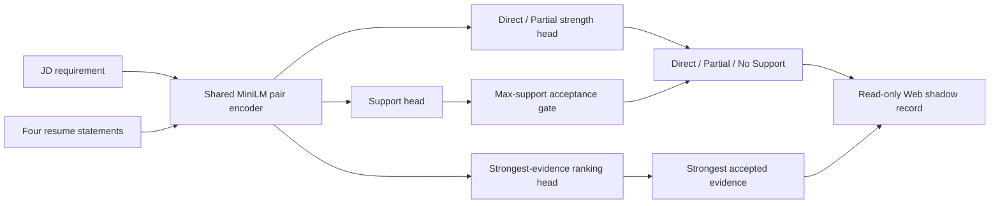
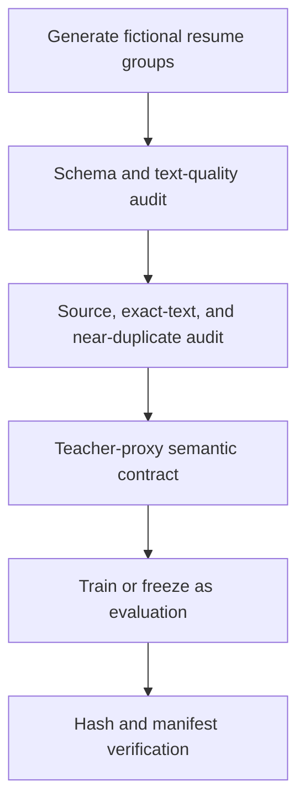

# From Retrieval Prototype to a Web-Shadow MiniLM System

## Executive summary

This project treats resume evidence matching as a production ML problem rather than a
single fine-tuning run:

```text
one job requirement + four resume-evidence candidates
    → Direct / Partial / No Support
    → strongest defensible evidence
```

The final v21 MiniLM candidate reached **90.63% task agreement**, **89.62% macro-F1**,
**90.00% No-Support recall**, and **100% supported Top-1** on a newly generated, frozen
96-task teacher-proxy evaluation. It runs locally at **137.9 pairs/s** on Apple MPS and is
connected to the Web application through an opt-in, background read-only Shadow path. These results measure agreement
with synthetic teacher contracts, not human-gold accuracy or hiring outcomes.

The more important outcome is the system around the model: isolated data lifecycles,
failure-driven training, leakage controls, frozen evaluation, artifact integrity, runtime
parity, privacy checks, and a strict boundary between shadow evidence and product decisions.

## Why this problem is difficult

Keyword overlap cannot determine whether a resume proves a requirement. A sentence may
mention the right tool while omitting ownership, production use, duration, scale, or one
clause of a compound requirement. Conversely, genuine evidence may be expressed through
an implicit outcome or a synonym.

The system therefore separates three questions:

1. Does each candidate provide any support?
2. If supported, is the coverage Direct or Partial?
3. Which supported candidate is strongest?

A false accept risks surfacing an unsupported claim; a false reject hides a real
qualification. Aggregate accuracy alone cannot represent that trade-off.

## Final architecture



One encoder supplies support, conditional strength, and rank signals. Acceptance uses the
maximum support probability; ranking uses a separate learned score. The public interface
returns `prediction`, `support_probability`, `direct_probability_given_support`, and
`rank_score`. It fails closed on malformed packets.

## Learning process

| Iteration | Fresh-set finding | Design response |
|---|---|---|
| Early multi-head experiments | Fixed prior correction moved every task below the support threshold | Removed unsupported logit shifts and separated representation from calibration |
| Native tri-class v16/v17 | No-Support rejection remained unreliable | Returned to hierarchical support then strength decisions |
| v18 | Better hierarchy, but E12 agreement was 69.79% and Top-1 76.79% | Retired E12 into diagnostics; preserved useful logits while targeting boundary errors |
| v19 | E13 agreement 68.75%; ranking improved to 83.93%, but agency/ownership errors remained | Added subject and agency counterfactuals |
| v20 | E14 agreement 84.38% and macro-F1 82.09%, but Direct recall fell to 53.13% and Top-1 to 73.21% | Diagnosed over-correction; added Direct-preserving possessive and accountability contrasts |
| v21 | Frozen E15 passed every gate | Packaged a hash-verified runtime and enabled non-decision Web shadow |

The key discipline was evaluation-set retirement. Once an evaluation exposed a failure,
it became development evidence; the next frozen result came from new text generated only
after model configuration and thresholds were fixed.

## Data and leakage controls



Controls include:

- fictional, privacy-safe resume groups across Software, Data, ML, and Business roles;
- complete four-candidate packets with every candidate label retained;
- stable source hashes and resume-group isolation;
- exact-text and token-Jaccard audits with a 0.85 exclusion threshold;
- class and role-family slices rather than enforced equal predictions;
- teacher confidence used diagnostically, never as proof of truth;
- shadow observations prohibited from returning to training;
- sealed operational holdouts kept unopened.

The v21 corpus contains 3,024 tasks and 12,096 pairs, including 1,296 targeted boundary
tasks. Frozen E15 contains 96 new tasks and 384 pairs. It has zero exact training overlap
and maximum token Jaccard 0.333.

## Frozen E15 result

| Metric | Result |
|---|---:|
| Task agreement | **90.63%** |
| Task macro-F1 | **89.62%** |
| Direct recall | **100.00%** |
| Partial recall | **79.17%** |
| No-Support recall | **90.00%** |
| Supported Top-1 | **100.00%** |
| Wilson 95% agreement interval | **83.14%–94.99%** |

Role-family agreement remained above the predeclared 85% floor: Software 87.50%, Data
91.67%, ML 95.83%, and Business 87.50%.

## Deployment engineering

The retained 91.6 MB bundle contains the model state, tokenizer and encoder configuration,
decision thresholds, artifact manifest, and SHA-256 commitments. On Apple MPS:

| Runtime gate | Result | Requirement |
|---|---:|---:|
| Throughput | 137.9 pairs/s | ≥20 pairs/s |
| p95 task latency | 41.5 ms | Diagnostic |
| Peak RSS | 876.6 MB | ≤1.5 GB |
| Offline/runtime parity | Exact | Required |
| Invalid input | Fail closed | Required |

The Web adapter ran over a frozen local snapshot of 57 jobs and 183 extracted requirements.
v21 accepted 27 (14.75%)
versus 18 (9.84%) for the prior shadow candidate. Because this operational snapshot is
unlabeled, it demonstrates changed coverage—not improved accuracy. The learned output
still has no authority over visible product scores or generated application text.

Live Shadow is disabled by default, runs outside the analysis request when enabled, and
persists only content hashes and aggregate comparison signals. Model weights and row-level
teacher data are intentionally not distributed in the public portfolio repository.

## What this project demonstrates

- multi-task NLP architecture design for classification and ranking;
- synthetic-teacher distillation without conflating agreement with truth;
- group, source, exact-text, and near-duplicate leakage prevention;
- diagnosis of calibration collapse, catastrophic movement, class-boundary errors,
  subject/agency confusion, and distribution shift;
- frozen promotion gates and evaluation-set retirement;
- offline PyTorch/Transformers packaging with integrity and parity checks;
- latency, throughput, memory, failure-mode, privacy, and regression validation;
- safe progression from offline research to non-decision Web shadow.

## Resume-ready framing

> Built a privacy-first MiniLM system that maps job requirements to defensible resume
> evidence using hierarchical support/strength classification and learned ranking; reached
> 90.6% agreement and 89.6% macro-F1 on a leakage-audited frozen teacher evaluation, with
> 100% supported Top-1.

> Designed a failure-driven NLP experimentation lifecycle with group-isolated synthetic
> data, near-duplicate audits, retired evaluation sets, frozen promotion gates, and a
> hash-verified local runtime delivering 138 pairs/s on Apple MPS.

> Integrated the model into a read-only Web shadow path with fail-closed inference and
> explicit rollout boundaries, preserving the transparent production baseline while
> collecting deployment-distribution evidence.
